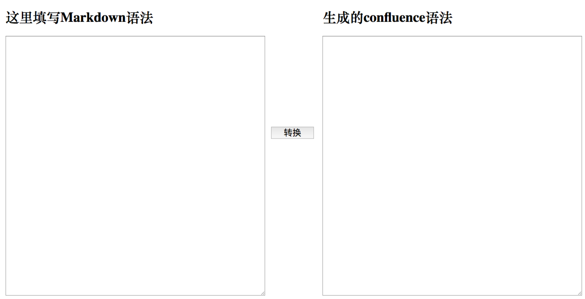
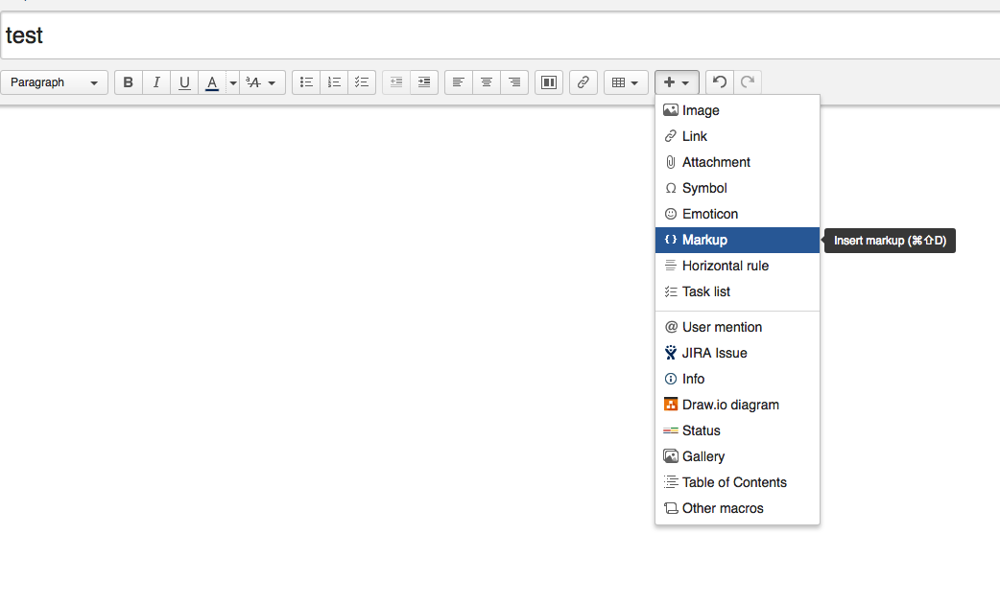
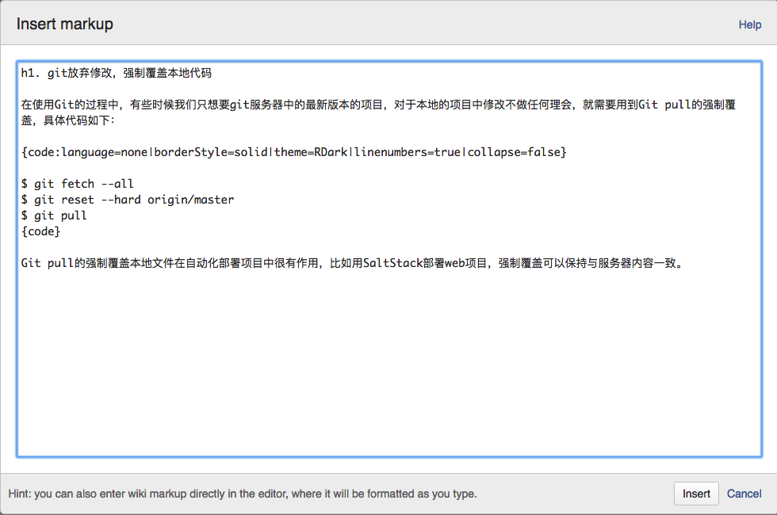

# Markdown2Confluence

使markdown语法转换为 confluence 语法的工具

## 使用方法

1. 下载源码

2. 浏览器里访问 `browser/index.html`

3. 左侧录入markdown语法的文章，点击转换，右侧会生成confluence 语法的文章

4. 复制右侧的代码，打开confluence的页面，点击加号按钮，选择Markup

6. 粘贴代码

